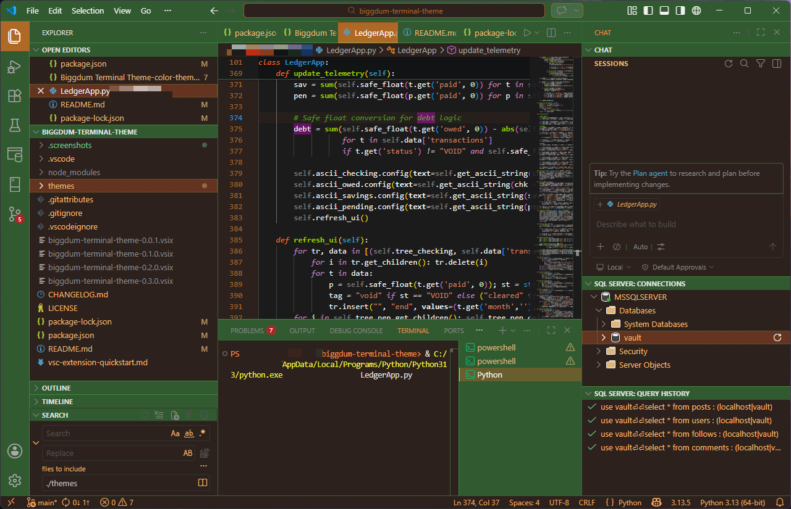
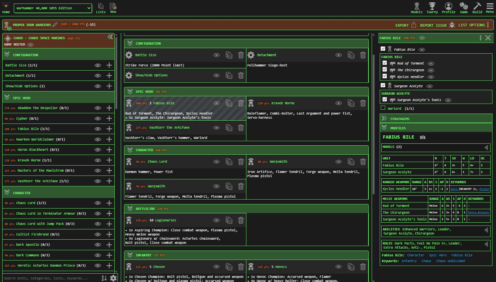
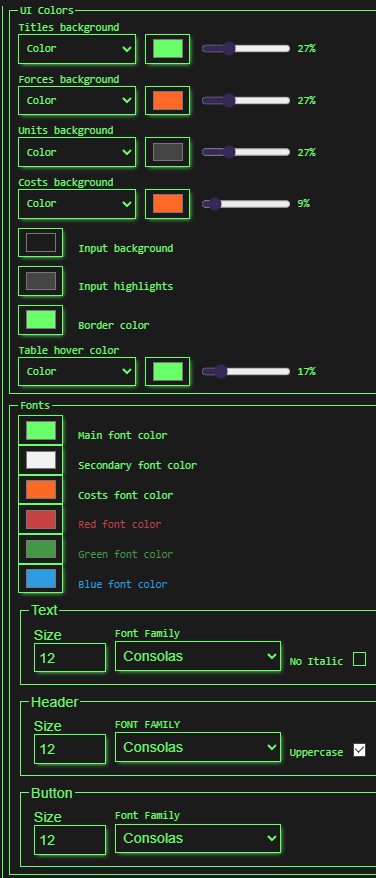
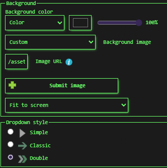

# biggdum-theme
*earthy* **colors** and `things`; **imagine** a `camoflauge commando` for the *Rebel Alliance* on the **forest planet** of `Endor`, `greens and browns` and *Ewoks*.

it's based on a theme i made for `newrecruit.eu`; ever a *work-in-progress*; send **suggestions** and `feedback as it were`;

# pics
*biggdum terminal* `theme` for **vscode**:

original `newrecruit.eu` theme:

---
| | |
|-|-|
|  |  |

# features
`various` *colors*

# release notes
this `theme` has been **released**

# creator
`dave`

# license
> whatever

# does anyone even read these things?
or just look at the pictures?
